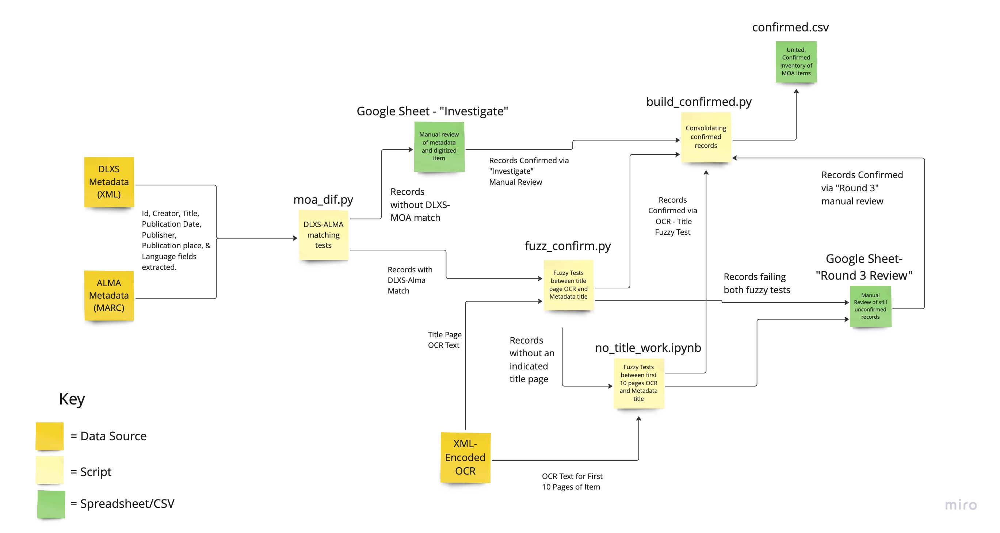

# Making of America Digital Collection Copyright Review Inventory
Jackson Huang, Curtis Hunt, and Gregory McCollum

## Objective

A verified inventory of all works held in the Making of America digital collection has not been compiled. In order to perform a copyright review of this collection, we developed an inventory of all items held in the collection, performing both automated and manual reviews to verify that existing collection metadata corresponds to the real digitized items.

## Project Description

Metadata for this collection is currently held in both MARC (for ALMA catalog entries) and XML (for the DLXS collection). We initially extracted metadata available from each record in both of these files and organized data into the following fields for ease of comparison: id, creator, title, publication date, publisher, publication place, language. 

These two sets of metadata were then compared to see if their titles and their publication years matched. An established key of corresponding DLXS and ALMA records was used to identify records for comparison. Those records whose field matched were consolidated into a single record for each work, and were utilized in further automated testing. To control for variations in spacing or punctuation, fuzzy testing was utilized to compare between ALMA and DLXS titles, with only records receiving high similarity scores passing.

DLXS and ALMA records that did not match were extracted and manually reviewed in a separate spreadsheet. This process involved consulting with the digitized item for each record and selecting a metadata set (DLXS or ALMA) that best matched the digitized text. Items for which the existing metadata (from either record) did not match the item were separated and investigated further. These manually reviewed items were added to the final confirmed inventory.

For DLXS and ALMA records that did match each other, the resulting consolidated record was tested further to verify that it corresponded to the digitized item. To do so, we performed multiple rounds of fuzzy testing comparing the metadata record’s title with the OCR from the digitized item’s title page. Initially, we compared the title with the existing collection OCR; for those items scoring under the established threshold, a second round of comparison occurred, comparing the metadata title with new OCR resulting from applying the Pytesseract library, a tool which performs optical character recognition on images, to the title page image. A separate script performed these operations on works which had no identified title page, instead utilizing the first 10 pages of each rather than a single title page.
Records that scored highly on these fuzzy tests (above an established threshold) were then added to the final confirmed inventory.

The remaining records that had not passed at any of these prior steps were manually verified, with corrections being introduced for records not reflecting the digitized texts they are associated with. These verified and corrected records were then added to the confirmed inventory.

## Project Figure

The figure below illustrates the same workflow described above. .PY and .IPYNB files referenced in the figure correspond to scripts files held in the Github repository. Green notes correspond to specific CSV or Google Sheets developed or utilized in this project. 

## Observed Issues

- **Metadata insufficient to describe materials/confusing.** 

    Occasionally, the metadata available made assessment of digitized items difficult. This was often the case with serialized works. Occasionally, the titles of serialized volumes changed over time, meaning that earlier works within the same series did not have the same titles as the metadata listed. In these cases, further consultation with ALMA MARC records (specifically 247: Former Title) fields or with external resources to confirm if a digitized item was correctly associated with a series that had since changed titles. This was the case for the “New York Historical Society Collections”, which were held the metadata title of “The John Watts DePeyster Publication Fund series.” Additional research was necessary to confirm that this was indeed the same series.

    Also, a number of items were “bound-with” volumes in which multiple separate items were bound together into a volume. Minimal metadata associated with these items, and that the title associated with these volumes does not appear in the digitized pages made assessment difficult. The “[Christian Pamphlets]” volumes.

    Items: [A sampling of these items can be found here.](https://docs.google.com/spreadsheets/d/1faBlnjZyOYCeUihYu3uLYtiRtDzTgA0wnV01qqPS1S0/edit?usp=sharing)

    Recommendation: Review items identified here.

- **Some items did not have catalog (ALMA) records associated with them.**

    A number of collection items were absent from the pre-provided key and/or included DLXS items without a corresponding ALMA record connected to it. Because of this, these items can not be found by users through the library catalog search, seriously inhibiting their discoverability. Furthermore, these records cannot be ingested into HathiTrust because of this, and these DLXS records will not be updated when changes are made to the collection via ALMA. 

    In some cases, we have sought to identify the ALMA catalog record we think ought to be associated with these records in the confirmed inventory, no action has been taken to link these records together.

    Items: [These items can be found here.](https://docs.google.com/spreadsheets/d/1coPPOy2y_5md-4KA455CBXMRigN4td3qkwMSjSvk6ZM/edit?usp=sharing)

    Recommendations: Review items and make appropriate ALMA connections.

- **DLXS items not associated with correct ALMA record**

    Additionally, DLXS items were at times linked to incorrect ALMA records, making their metadata incorrect. These items could be linked to wholly incorrect items, or were linked to digital-collection only records in ALMA, not the main catalog item. Users are likely to struggle to find the full digitized items because of this and these DLXS items will be not be updated along with the rest of the catalog.

- **Items that shouldn’t be in MOA**

    Additionally, several of the items included in the Making of America collection did not appear to be within the digital collection’s topical scope. Specifically, our team felt as though they did not discuss or pertain to the history of the United States, the expressed collecting area of Making of America.

    Items: [These items can be found here.](https://docs.google.com/spreadsheets/d/1KTFxk702Vx0rpNfRYpPQOXqFmGBPN2fPdWdo10hjggo/edit?usp=sharing)
    
    Recommendation: Review of identified items and their inclusion in light of collecting goals.

## Resources

- [Inventory](https://github.com/GregMcC5/moa/blob/main/confirmed/confirmed.csv)
- ["Investigate" Google Sheet](https://docs.google.com/spreadsheets/d/1YWLjFR-UIu9wHBA2P_vXu6TjXJ9eUykGAFuLQKXSMb4/edit?usp=sharing)
- ["Round 3 Review" Google Sheet](https://docs.google.com/spreadsheets/d/16eazdIvGNhc_iKcljMLcBQwawhL9Up4nm10-MBe4x0w/edit?usp=sharing)